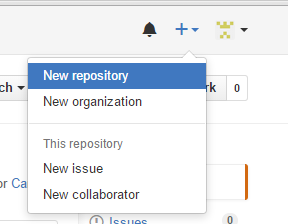
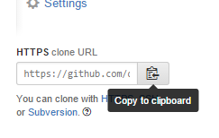
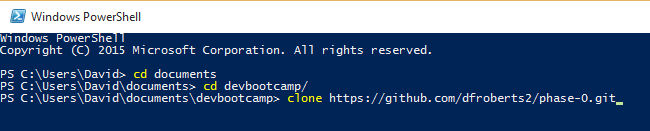

#My Website 1 Reflection 
##Paste a link to your [USERNAME].github.io repository.
[My Website](dfroberts.github.io)

##Explain how to create a repository on GitHub and clone the repository to your local computer to a non-technical person
Once logged into your GitHub account, click the "+" at the top right and go through the instructions for a new repository: 

Then in the command line, enter directory you wish to place the repository on your machine. On GitHub copy the repository git link at the bottom right of the page:

Then type in git clone [URL] into the command line:

Enter your credentials and your new repository should be cloned onto your local machine

##Describe what open source means.
Open source means that somebody's coding work is available for editing, copying or any type of modification by others. It can be also be distributed free of charge (depending on the license).

##What do you think about Open Source? Does it make you nervous or protective? Does it feel like utopia?
I understand open source is a big feature of software development. Since coding is very community oriented, open source helps many developers out there collaborate and share ideas. However, if you have an idea that you do not wish to be copied by others, you have to be carefully how you license your software.

##Assess the importance of using licenses.
Licenses are important because they describe how software can be distributed and monetized. It is important to choose the proper license if you do wish to profit from your code, or if you do not another to profit from your work.

##What concepts were solidified in the challenge? Did you have any "aha" moments? What did you struggle with?
This challenge solidified my git skills. I feel very comfortable with them now, but understand more practice will only help.

##Did you find any resources on your own that helped you better understand a topic? If so, please list it.
When writing up my 2nd response, I needed to post images so I looked up how to display images in markdown [here](https://guides.github.com/features/mastering-markdown/)
