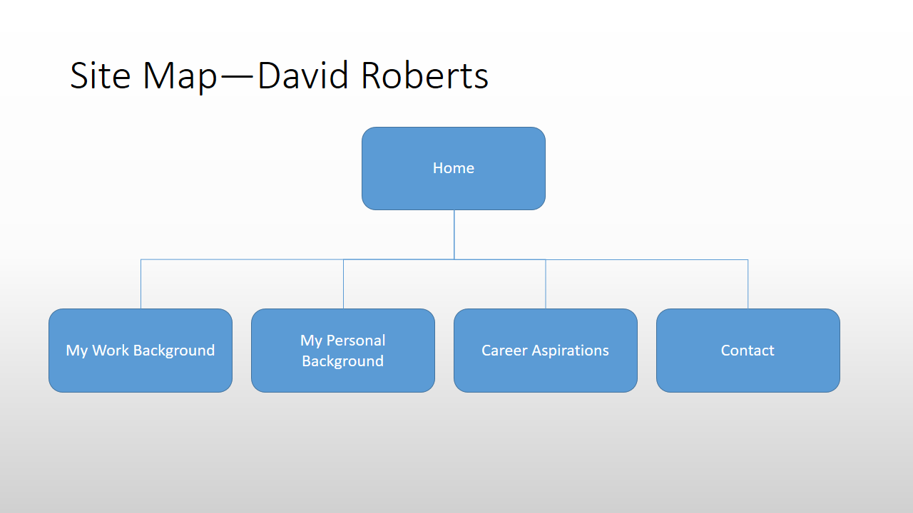

#2.3 Introduction to Design and Site Planning

##My Site Map:

##What are the 6 Phases of Web Design?
1. Information Gathering
2. Planning
3. Design
4. Development
5. Testing and Delivery
6. Maintenance	

##What is your site's primary goal or purpose? What kind of content will your site feature?
My site's primary goal is to introduce myself to both the public and to possible future employers. I will feature brief write-ups about myself and my professional history as well as projects I have completed. I may or may not link content from creative endeavours.

##What is your target audience's interests and how do you see your site addressing them?
My target audience interest is to get sense of who I am and what work I am capable of. Because of this, I am providing a well-rounded view of myself. I will give both professional and non-professional information about myself.

##What is the primary "action" the user should take when coming to your site? Do you want them to search for information, contact you, or see your portfolio? It's ok to have several actions at once, or different actions for different kinds of visitors.
I want the user to read and view the content about myself and I wish for them to contact me if they are interested in my work or have questions.

##What are the main things someone should know about design and user experience?
User experience design's main goal is for the user to feel comfortable and positive about the features of a website. This is why design patterns are so critical to user experience. Some patterns are better at providing a familiar experience to the user so that the user doesn't feel the burden of learning how to navigate a website and can just focus on the website's content.

##What is user experience design and why is it valuable? 
User experience design takes into account the emotions of the user as they navigate a website. It's a design method that is not solely focused on providing the proper content to the user. It is focused on the emotion of the user so that they are in the best possible frame-of-mind to receive the content and utilize it.

##Which parts of the challenge did you find tedious?
While I didn't find it tedious, I found the "6 Phases of the Web Site Design and Development Process" article a bit difficult to go through. Coincidentally, it wasn't the content of the article I wasn't very fond of, it was actually the design style. I think the writer was going for a "techy" feel and used dark shades for his background and font. But I actually found this style made it more bothersome to go through. Still it was a good article.