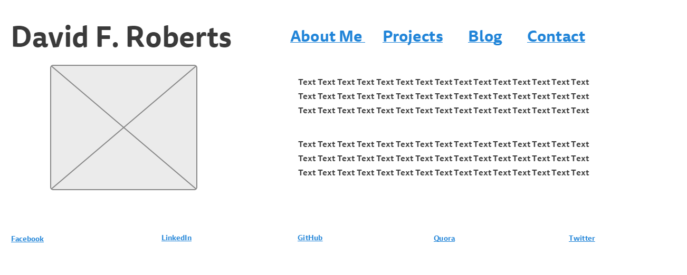
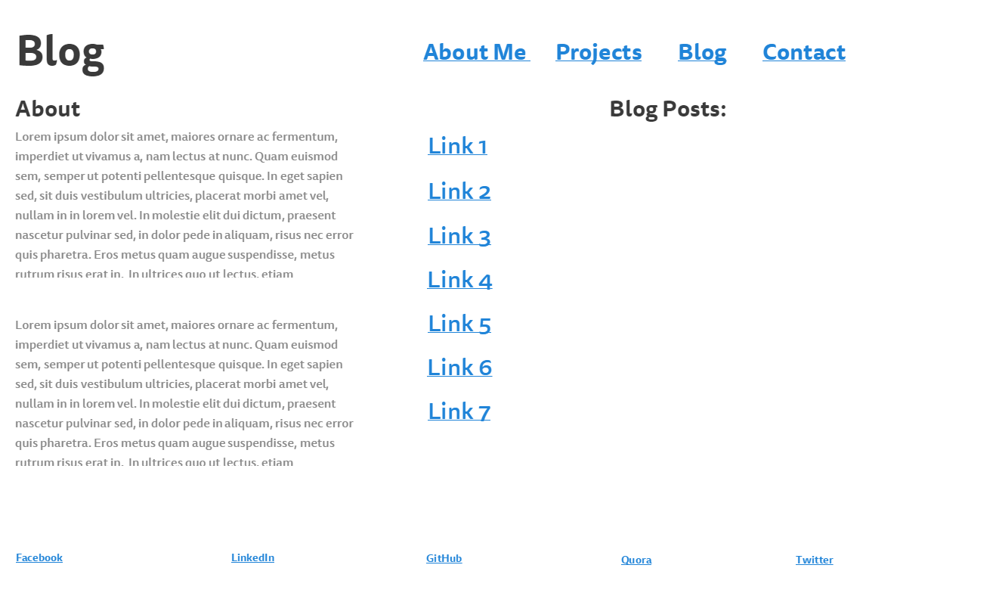

#2.3 Wireframing

##Main Page wireframe:

##Blog Page wireframe:

##What is a wireframe? and what are the benefits of wireframing?
A wireframe is a website planning device used to map out the layout of a webpage. It helps because it helps communicate to both the designer and the owner how user will experience and navigate the site. 

##Did you enjoy wireframing your site?
Yeah, it is currently a rough sketch and still in the planning phase as I learn what I want my site to be. But it gave me a basic idea of the elements I want in my site and how I would like to plan them out.

##Did you revise your wireframe or stick with your first idea?
I experiemented along the way and tried different designs along the way.

##What questions did you ask during this challenge? What resources did you find to help you answer them?
I wanted to find the simplest wireframing tool that would be free to use and easy to export. I found that [Go Mockingbird](gomockingbird.com) was a very good option. It does require sign up and you can easily export your wireframe as a pdf or png file.

##Which parts of the challenge did you enjoy and which parts did you find tedious?
I didn't find any parts tedious. Wireframing is a very intuitive process. And there are lots of resources out to help you in the wireframing process.