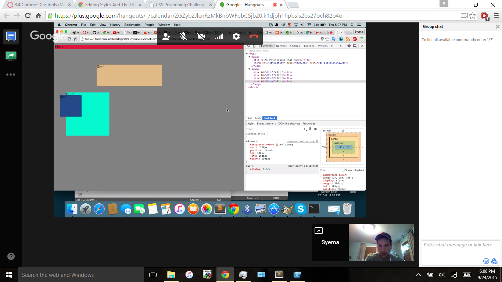
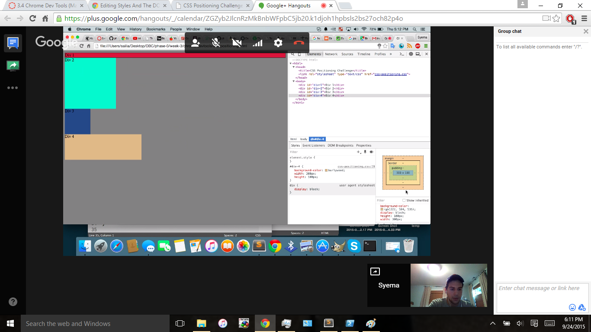
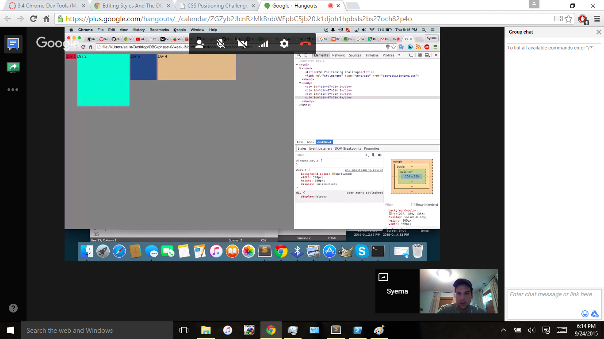
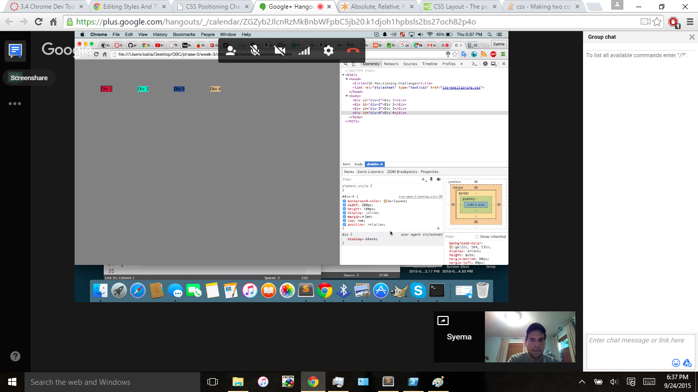
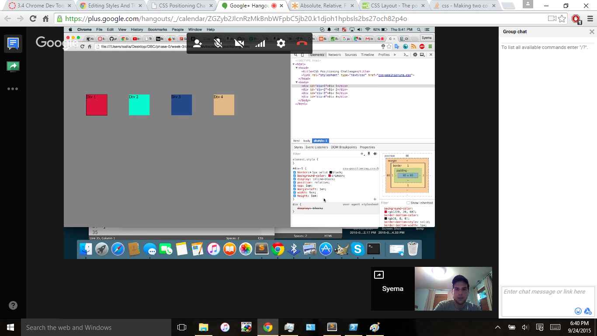
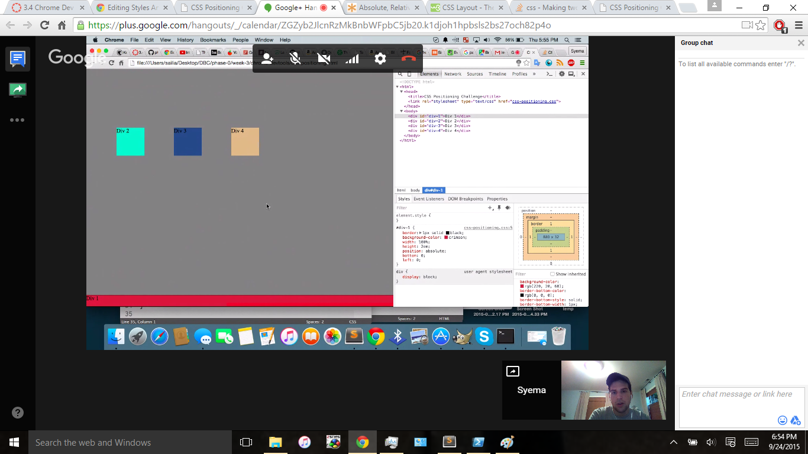
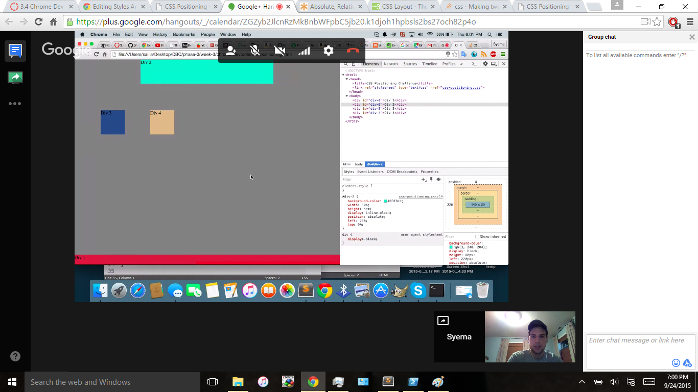
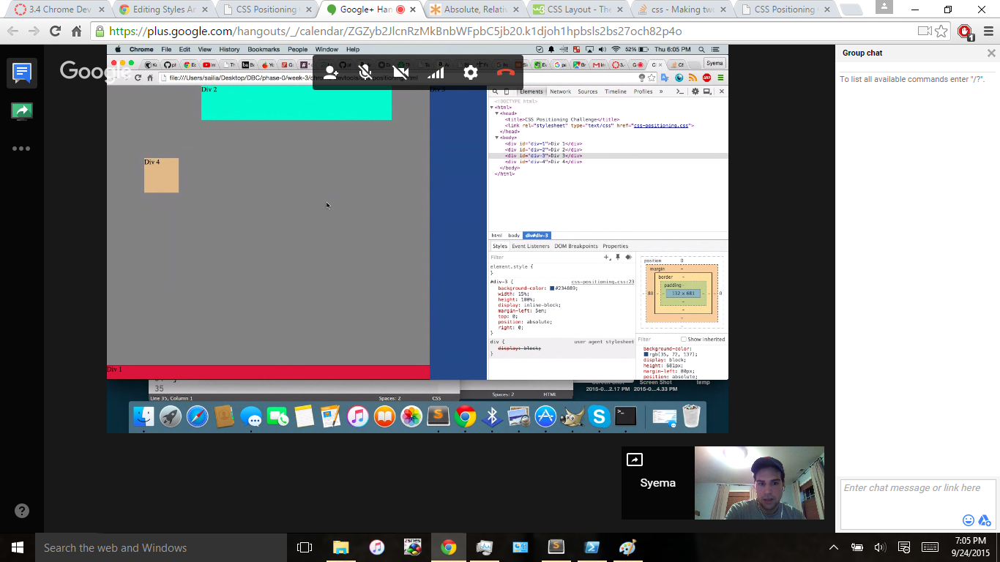
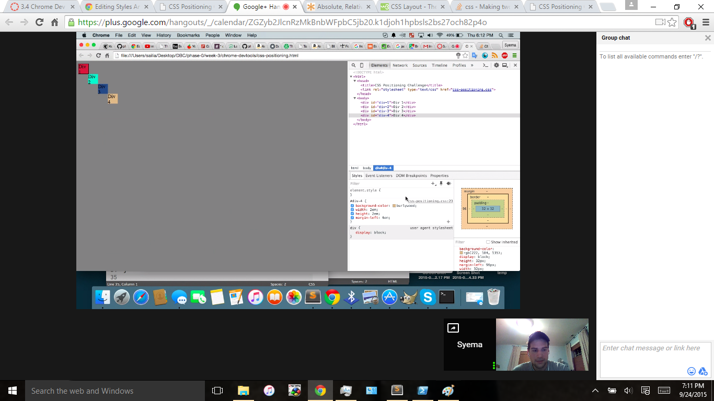

#Exercise 1:

#Exercise 2:

#Exercise 3:

#Exercise 4:

#Exercise 5:

#Exercise 6:

#Exercise 7:

#Exercise 8:

#Exercise 9:

#How can you use Chrome's DevTools inspector to help you format or position elements?
In the style section, once you've selected an element, you can set the display type and positioning type as well as chaning the margin, padding, top, bottom, left and right properties. When you change these properties

#How can you resize elements on the DOM using CSS?
You resize elements by changing the height and width of the element.

#What are the differences between Absolute, Fixed, Static, and Relative positioning? Which did you find easiest to use? Which was most difficult?
*With Absolute positioning, you can set the exact coordinates of the element relative to the ends of the screen
*With Relative positioning, you can set the coordinates of an element relative to where the element would normally lie.
*With Fixed positioning, you set the coordinates of the element the same way as Absolute, but it always stays in that position on the screen, no matter how much you scroll
*
Absolute positioning is the easiet to use I think b/c you don't have to worry about where the element would lie by default. You can set it exactly 

#What are the differences between Margin, Border, and Padding?
Margin is the space outside of the border. Border is the line (imaginary or displayed) enclosing the element. Padding is the space between the content of the element and the border.

#What was your impression of this challenge overall? (love, hate, and why?)
I thought it was easy most of the time. I enjoyed it because it gave us a chance to experiment with all of the positioning properties, which can be tricky.