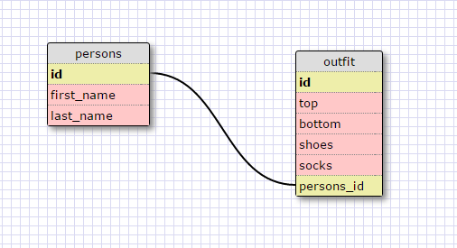

#8.4 Introduction to Database Schemas and SQL

##Release 5
#Select all data for all states
```
SELECT * FROM states;
```
##Select all data for all regions.
```
SELECT * FROM regions;
```
#Select the state_name and population for all states.
```
SELECT state_name, population FROM states;
```
#Select the state_name and population for all states ordered by population. The state with the highest population should be at the top.
```
SELECT state_name, population
FROM states
ORDER BY population DESC;
```
#Select the state_name for the states in region 7
```
SELECT state_name FROM states WHERE region_id=7;
```
#Select the state_name and population_density for states with a population density over 50 ordered from least to most dense.
```
SELECT state_name, population_density FROM states WHERE population_density>50 ORDER BY population_density ASC;
```
# Select the state_name for states with a population between 1 million and 1.5 million people
```
SELECT state_name FROM states WHERE population>1000000 AND population<1500000;
```
#Select the state_name and region_id for states ordered by region in ascending order.
```
SELECT state_name, region_id FROM states ORDER BY region_id ASC;
```
#Select the region_name for the regions with "Central" in the name.
```
SELECT region_name FROM regions WHERE region_name LIKE '%Central'
```
#Select the region_name and the state_name for all states and regions in ascending order by region_id. Refer to the region by name
```
SELECT regions.region_name, states.state_name
FROM states
INNER JOIN regions ON states.region_id=regions.id
ORDER BY states.region_id ASC;
```

##Schema:


##What are databases for?
A database is a system used to store data in an organized fashion. A good database can link together different data resources and query specific sets of data within the database.
##What is a one-to-many relationship?
A one-to-many relationship is a type of cardinality between two data tables. It describes that for an one of a specific data type, there can be many of another type. An example of this is states and regions. For everyone one region, there are many states, but it does not work vice-versa. There are not many regions for every one state.
##What is a primary key? What is a foreign key? How can you determine which is which?
A primary key is a key that is unique for every record in a table. There can not be duplicates of it. If this key is displayed in another related table, it is a foreign key. If there is duplicates of a key in a table, it is likely that it is a foreign key.
##How can you select information out of a SQL database? What are some general guidelines for that?
You can select information out of a SQL database using the SQL command "SELECT." "SELECT" chooses a field or multiple field names from a specific table (denoted using the command "FROM")