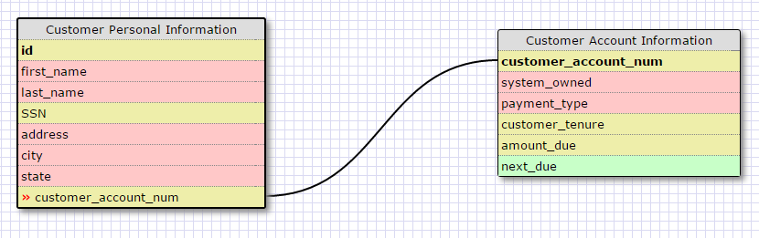
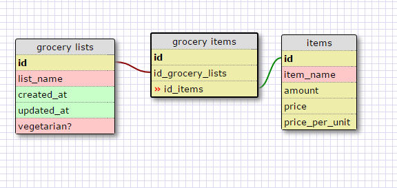

##One-to-one Database

This is an example of a one to one relationship for data a business might have on their customers. When I worked at Verzion, we would deal with this type of data. It is a one-to-one relationship b/c each individual can only have one account with the business (not always the case, but in this case it's true.) One department dealing with bill collection may be different than the department dealing with collecting customer personal info (such as address changes). This is why having separate data tables, with a one-to-one relationship is helpful.

##Many-to-many Database

##What is a one-to-one database?
A one-to-one database is when two data tables are linked, and for ever one instance of the first table, there is only one linked instance in the second table.

##When would you use a one-to-one database? (Think generally, not in terms of the example you created).
A one-to-one database is good for separating different types of data. The data for a one-to-one database could logically live in a single table, but it's subject matter may be unrelated so it's good to separate it.

##What is a many-to-many database?
A many-to-many database is when two or more tables are linked, but there are many instances of the first table that can be linked to many instances of the other tables.

##When would you use a many-to-many database? (Think generally, not in terms of the example you created).
When trying to process complex sets of data or merge data from a variety of sources.

##What is confusing about database schemas? What makes sense?
Database schemas look like actual data tables, but they are just a visualization tool for an actual data table.